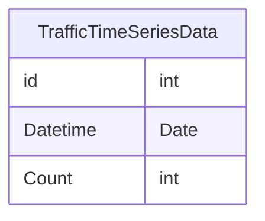
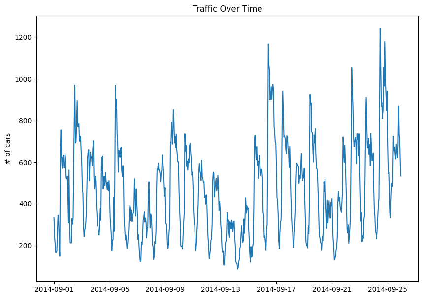
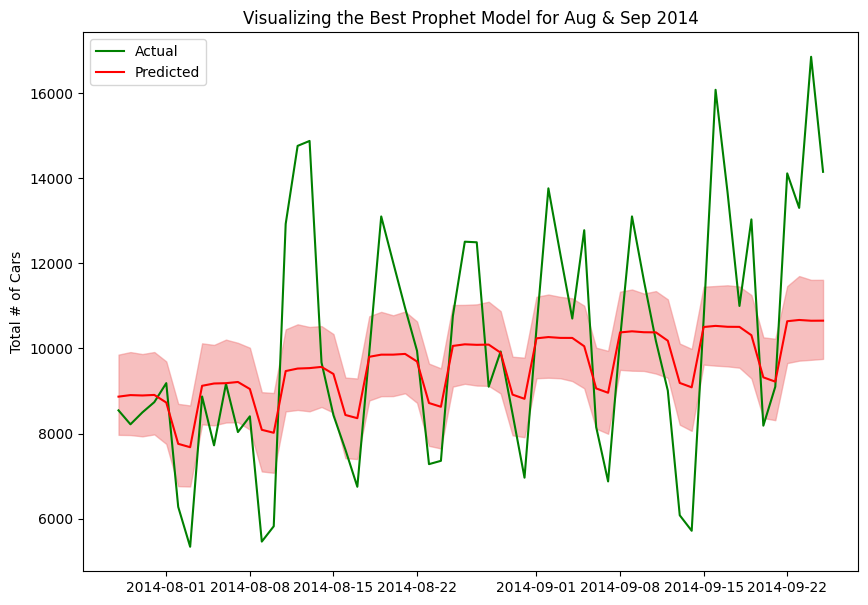
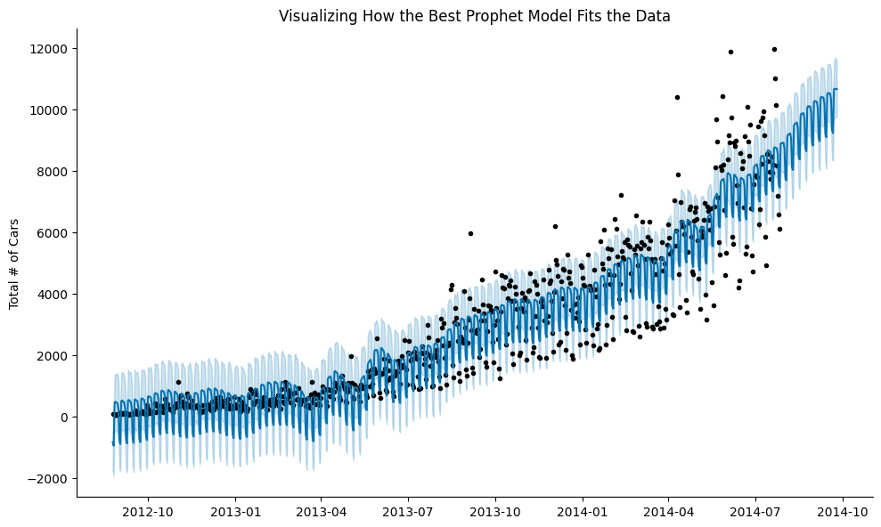

# Traffic Forecasting

## Datasets
1. [Traffic_data](data/TrafficDataTimeSeriesAnalysis.csv)
2. [Traffic Prediction Dataset (Kaggle)](https://www.kaggle.com/datasets/fedesoriano/traffic-prediction-dataset)

## Jupyter Notebooks
1. [traffic_forecast_1.ipynb](./traffic_forecast_nb1.ipynb): Built for the Dataset #1
2. traffic_forecast_2.ipynb: Built for the Dataset #2

## Metrics to Evaluate Models
1. **Mean Absolute Error (MAE)**
   MAE measures the average magnitude of the errors in a set of predictions, without considering their direction. It’s the average over the test sample of the absolute differences between prediction and actual observation.

    ```math
     \text{MAE} = \frac{1}{n} \sum_{i=1}^{n} |y_i - \hat{y}_i|
     ```

2. **Root Mean Squared Error (RMSE)**
   RMSE is the square root of the mean squared error. It provides a measure of how spread out these residuals are, and it is in the same units as the target variable.

   ```math
   \text{RMSE} = \sqrt{\frac{1}{n} \sum_{i=1}^{n} (y_i - \hat{y}_i)^2} 
   ```
3. **Mean Absolute Percentage Error (MAPE)**
   MAPE measures the size of the error in terms of percentage. It is calculated as the average of the absolute percentage errors.

   ```math
   \text{MAPE} = \frac{100}{n} \sum_{i=1}^{n} \left| \frac{y_i - \hat{y}_i}{y_i} \right| 
   ```

# Project 1: Beginner Level
## The Dataset #1


This dataset includes the following columns:
1. **ID:** Primary key of the dataset (not required for the project)
2. **Datetime:** Includes the date and time taken at an interval of every hour.
3. **Count:** The number of cars at the particular date & time.  

There are a total of **18,288 rows** of data.

### Assumptions
We do not have much information about the dataset - like how or where the data was collected. Therefore we can assume that this is the data of the number of cars on the street at one particular road intersection over time.

## Exploratory Data Analysis

We can see that the traffic volume changes quite a lot during each day. This makes sense as there could be more traffic in the rush hour of the mornings and evenings while being relatively much lower during off-peak times.

## Machine Learning Model Results
### Prophet from Facebook (Meta)
**Comparing Prophet Models:**


It was surprising to see that the Bayesian Optimization led to results which were just barely better than the baseline model in terms of the RMSE score & R-squared, and worse in terms of MAE & MAPE. 

We can see that the second model (in this case with GridSearchCV) was the overall best performing model because of the following reasons:
1. It has the best performance on 3 out of 4 metrics:
   - lowest MAE, 
   - lowest RMSE  
   - only slightly worse MAPE compared to Model 1.
   - highest R-squared
2. The higher R-squared indicates it captures more of the underlying patterns in the data.

#### Visualizing Prophet Model
**Graphs showing the Overall, Weekly & Yearly Trend**


From the above 3 graphs we can see the following:
   1. Exponential growth from 2012 to 2014 on the number of cars on the street.
   2. Relatively lower amount of cars on the weekends and much more cars on weekdays. This suggests that the area where the data was collected was likely commercial neighborhood.
   3. Between months March & May there was a dip in the number of cars on the street. This coincides with vacations in summer for many employees. The highest cars are present between the months of September to November. After november we can see another dip until January - which coincides with the Winter breaks and vacations

**Graph showing Actual vs Predicted Values**



**Visualizing How the Best Prophet Model Fits the Data**



### Random Forest
WIP

## Deep Learning Models
WIP

### Recurrent Neural Networks (RNN)
WIP

## Statistical Models
### Seasonal Auto-Regressive Integrated Moving Average (SARIMA) 
WIP

# Project 2: Intermediate Level on Dataset #2
## Machine Learning Models
WIP

## Deep Learning Models
WIP

## Statistical Models
WIP


# References
https://www.youtube.com/watch?v=6GX5SO_V46c&list=LL&index=5&t=1532s&ab_channel=HackersRealm
https://www.geeksforgeeks.org/introduction-to-recurrent-neural-network/
