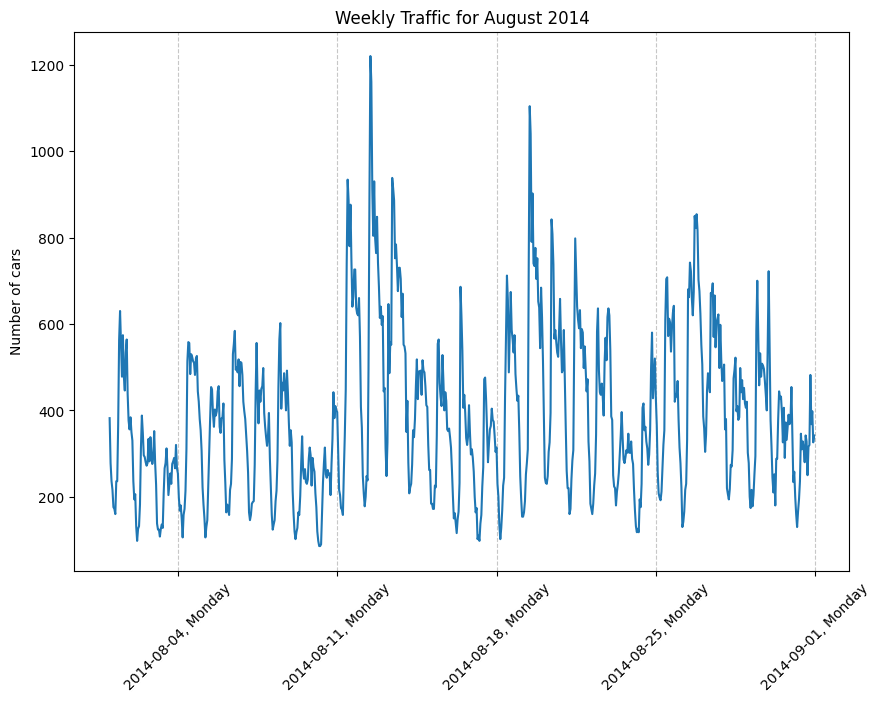
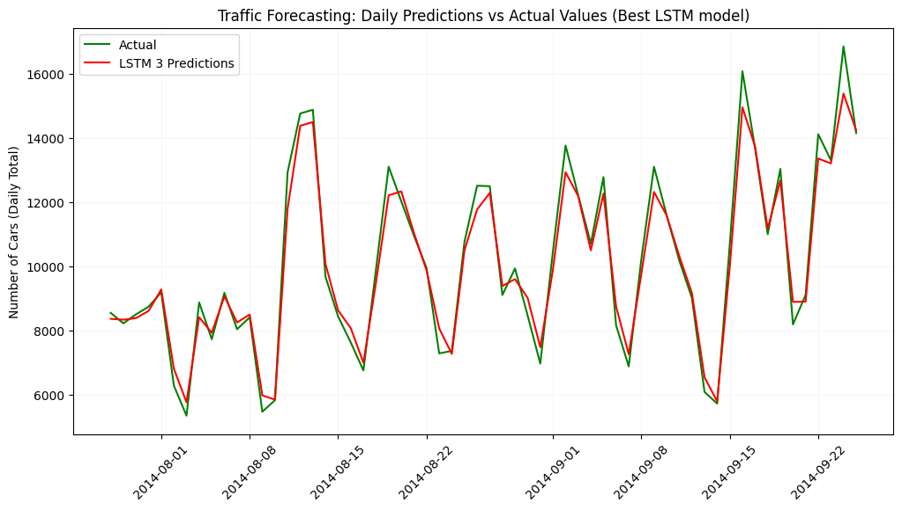

# Traffic Forecasting

Aim: To build a robust forecasting solution that can fairly accurately predict future traffic 

## Projects
1. [Project 1: Generic Traffic Forecasting (At 1 Road Intersection)](./README.md#project-1-generic-traffic-forecasting-at-1-road-intersection)
2. [Project 2: Traffic Forecasting (For 4 Road Intersections)](./README.md#project-2-traffic-forecasting-for-4-road-intersections)
3. Project 3: Traffic Forecast for City of Toronto (soon)

## Jupyter Notebooks
1. [traffic_forecast_1.ipynb](./traffic_forecast_nb1.ipynb): Built for the Project #1
2. traffic_forecast_2.ipynb: Built for the Project #2

## Metrics to Evaluate Models
1. **Mean Absolute Error (MAE)**
   MAE measures the average magnitude of the errors in a set of predictions, without considering their direction. It’s the average over the test sample of the absolute differences between prediction and actual observation.

    ```math
     \text{MAE} = \frac{1}{n} \sum_{i=1}^{n} |y_i - \hat{y}_i|
     ```

2. **Root Mean Squared Error (RMSE)**
   RMSE is the square root of the mean squared error. It provides a measure of how spread out these residuals are, and it is in the same units as the target variable.

   ```math
   \text{RMSE} = \sqrt{\frac{1}{n} \sum_{i=1}^{n} (y_i - \hat{y}_i)^2} 
   ```
3. **Mean Absolute Percentage Error (MAPE)**
   MAPE measures the size of the error in terms of percentage. It is calculated as the average of the absolute percentage errors.

   ```math
   \text{MAPE} = \frac{100}{n} \sum_{i=1}^{n} \left| \frac{y_i - \hat{y}_i}{y_i} \right| 
   ```

# Project 1: Generic Traffic Forecasting (At 1 Road Intersection)
## The Dataset #1


This dataset includes the following columns:
1. **ID:** Primary key of the dataset (not required for the project)
2. **Datetime:** Includes the date and time taken at an **interval of every hour**.
3. **Count:** The number of cars at the particular date & time.  

There are a total of **18,288 rows** of data.

### Assumptions
We do not have much information about the dataset - like how or where the data was collected. Therefore we can assume that this is the data of the number of cars on the street at one particular road intersection over time.

## Exploratory Data Analysis

Graph 1: Graph visualizing traffic over time for the entire dataset.


Graph 2: Zoomed in visual of the monthly traffic in 2014.


Graph 3: Zoomed in visual of the weekly traffic in August 2014.



Graph 4: Zoomed in visual of the daily traffic for 1st Week of August 2014.


From the above graphs, we can see that:
1. The dataset is **not stationary** i.e.:
   - From Graph 1 & 2, the mean, µ, is not constant across the entire graph - it looks like the mean is increasing.
   - From Graph 1 & 2, the variance, σ, is not constant across the entire graph - it looks like the variance is gradually increasing.
   - There is **seasonality**:
     - From Graph 3, we can see some **weekly seasonality** - Mon to Fri the peaks are usually a bit higher and the peaks on Sat & Sun are lower each week.
     - From Graph 4, we can also see some **daily seasonality** - there are high peaks, perhaps during rush hour, and low peaks, perhaps during off-peak times each day.

If we want to check whether this dataset exhibits stationarity apart from just looking at the graph, we can also use the **Augmented Dickey-Fuller (ADF)** statistical test.

## Which Models Not to Try
Since the dataset exhibits non-stationarity we **can't use the following models** (or more so, we shouldn't directly try these models):
- **Linear Regression**: As they assume linear relationship between variable(s).
- **Auto-Regressive/ Moving-Average/ ARMA/ ARIMA/ SARIMA** models: when there is non-stationarity, these models may not capture underlying trends leading to incorrect forecasts.
- **K-Nearest Neighbor (KNN) Regression**: if a datasets is non-stationary, the similarity between data points may not be meaningful, leading to poor forecasts.

However, we can try to transform the data to be stationary and then use any of these models. In this project, for a fair comparison between models, I have not performed much 

## Machine Learning Model Results
### Prophet from Facebook (Meta)

**Reasons for Choosing Prophet Model**
1. Handles Seasonality Well: Traffic typically has multiple seasonal patterns (daily, weekly, and yearly).
2. Robust to Missing Data: Prophet handles missing data gracefully without requiring explicit imputation.
3. Handles Outliers: Traffic data can have outliers due to accidents, special events, or holidays.
4. Fast and Scalable: Prophet is computationally efficient and can handle large datasets common in traffic monitoring
5. Built-in Uncertainty Estimates: Provides confidence intervals for forecasts.


**Recognizing Downsides of Prophet Model**
- Limited External Variables: Not as flexible as other models for incorporating multiple external features
- Fixed Model Structure: Less flexible than deep learning models for capturing complex patterns
- Over-fitting Risk
- Limited Control: Less control over the underlying model compared to traditional statistical methods and some parameters are automatically set and can't be easily modified


**Comparing Prophet Models:**


It was surprising to see that the Bayesian Optimization led to results which were just barely better than the baseline model in terms of the RMSE score & R-squared, and worse in terms of MAE & MAPE. 

We can see that the second model (in this case with GridSearchCV) was the overall best performing model because of the following reasons:
1. It has the best performance on 3 out of 4 metrics:
   - lowest MAE, 
   - lowest RMSE  
   - only slightly worse MAPE compared to Model 1.
   - highest R-squared
2. The higher R-squared indicates it captures more of the underlying patterns in the data.

#### Visualizing Prophet Model
**Graphs showing the Overall, Weekly & Yearly Trend**


From the above 3 graphs we can see the following:
   1. Exponential growth from 2012 to 2014 on the number of cars on the street.
   2. Relatively lower amount of cars on the weekends and much more cars on weekdays. This suggests that the area where the data was collected was likely commercial neighborhood.
   3. Between months March & May there was a dip in the number of cars on the street. This coincides with vacations in summer for many employees. The highest cars are present between the months of September to November. After november we can see another dip until January - which coincides with the Winter breaks and vacations

**Graph showing Actual vs Predicted Values**


We can see the actual data points plotted in green and the Prophet model's predictions shown in red. The Prophet model also returns the upper and lower bound confidence interval which is represented by the light red shading. This visualization helps compare the model's forecasting performance against the ground truth values.

**Visualizing How the Best Prophet Model Fits the Data**


The above graph shows the scatter plot of actual data points and shows the Prophet model's predictions for the entire data set (train & test) ranging from 2012 to 2014.

## Deep Learning Models
### Long Term Short Term Memory (LSTM)
**Reasons for Choosing LSTMs:**
1. Memory of Historical Patterns: LSTMs have a "memory cell" that can remember long-term dependencies.
2. Handles Multiple Seasonality: Traffic data shows daily, weekly and seasonal patterns. For example the data shows daily rush hours, weekend vs weekday differences and seasonal variations. LSTMs can capture these complex temporal patterns and handle long-term dependencies better than simple RNN models.
3. Variable Input Lengths: Useful when dealing with irregular sampling or missing data and it is flexible for different prediction horizons.
4. RNNs at times suffer from the **vanishing gradient problem** which can be minimized by using LSTMs. 

**Recognizing Downsides of LSTMs**

- Computational Resources: LSTMs are more computationally intensive.
- Many Hyperparameter to Tune (layers, units, dropout rate, etc.)
- Black Box Nature: Limited interpretability of predictions.
- Over-fitting Risk

**Comparing LSTM models**


From the above table, we can see that the 3rd Grid Search Tuned LSTM model has outperformed our initial baseline model on all of the metrics.

The 2nd Grid Search Tuned LSTM model was quite bad perhaps due to the following reasons:
 - It explored a suboptimal parameter space
 - I had issues with local minima during training

**Visualizing How the Best LSTM Model Fits The Data**


The above graph shows the scatter plot of actual data points and shows the LSTM model's predictions for the last 7 days (in the test set).

## Statistical Models
### Seasonal Auto-Regressive Integrated Moving Average (SARIMA) 

**Notation**

```
   ARIMA (p, d, q)1 (P, D, Q)m
```
where:
- p: 
- d: 
- q: 
- P: 
- D: 
- Q: 
- m: seasonal factor - number of periods within a year for the seasonality to repeat

**Reasons for Choosing SARIMA**

...

**Recognizing the Downsides of SARIMA**

...

## Learnings

1. Sometimes hyper-parameter tuning with Grid Search may result in a worse model than the baseline. This can be due to the following reasons:
   - Explored a suboptimal parameter space.
   - Had issues with local minima during training.
2. The LSTM model had data scaled from 0 to 1. After the predictions, initially I missed scaling it back to the original value which gave incorrect MAE, MSE, RMSE and R-Squared values.
3. The LSTM model was trained to predict the data per hour. In the prophet model I had initially trained the data to predict the traffic per day. Therefore, the graphs didn't match. Once I converted the LSTM graph to show the number of cars per day, both the Prophet model graph and the LSTM model graphs can be compared:




On further thought, predicting traffic per hour is much more useful from a business perspective as compared to predicting the total traffic per day.

# Project 2: Traffic Forecasting (For 4 Road Intersections)
## Machine Learning Models
WIP

## Deep Learning Models
WIP

## Statistical Models
WIP


# References
- Time Series Playlist by ritvikmath: https://www.youtube.com/playlist?list=PLvcbYUQ5t0UHOLnBzl46_Q6QKtFgfMGc3
- https://www.youtube.com/watch?v=6GX5SO_V46c&list=LL&index=5&t=1532s&ab_channel=HackersRealm
- https://www.geeksforgeeks.org/introduction-to-recurrent-neural-network/
- https://machinelearningmastery.com/how-to-improve-neural-network-stability-and-modeling-performance-with-data-scaling/
- 
_(WIP - convert the references to MLA/ APA format)_